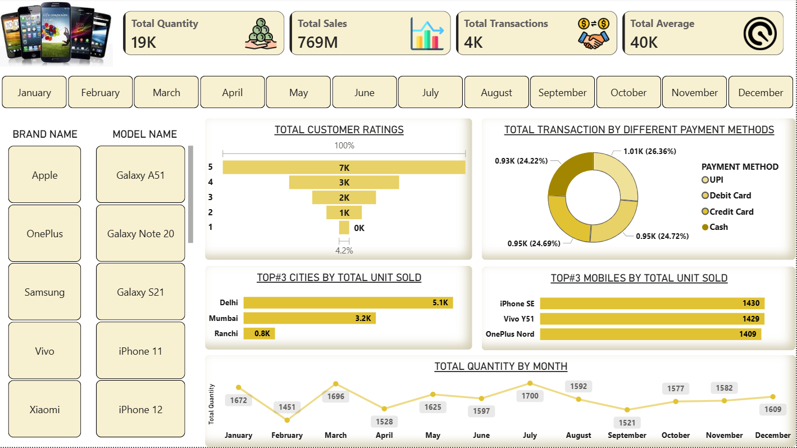

# 📱 Mobile Sales Dashboard – Power BI Project

## 📌 Project Overview
This project is an interactive **Mobile Sales Dashboard** created using **Power BI** to analyze and visualize mobile sales data effectively. The dashboard provides meaningful business insights related to sales performance, customer behavior, transactions, ratings, and product trends.

The objective of this project is to transform raw sales data into an easy-to-understand and visually appealing dashboard that helps in better decision-making through data-driven insights.

---

## 📷 Dashboard Preview

---

## 🚀 Features
- 📊 Total Sales, Quantity, Transactions & Average Analysis
- ⭐ Customer Rating Visualization
- 💳 Transaction Analysis by Payment Methods
- 🏙️ Top Cities by Units Sold
- 📱 Top Selling Mobile Models
- 📅 Monthly Quantity Trend Analysis
- 🔍 Interactive Filters for Brand & Model Selection
- 🎨 Clean and User-Friendly Dashboard Design

---

## 🛠️ Tools & Technologies Used
- Power BI
- Microsoft Excel
- DAX (Data Analysis Expressions)
- Data Modeling
- Data Visualization Techniques

---

## 📈 Key Insights
- Identified top-performing mobile brands and models
- Analyzed customer rating distribution
- Compared payment methods used in transactions
- Tracked monthly sales quantity trends
- Discovered highest sales contribution by cities

---

## 🎯 Learning Outcomes
Through this project, I gained hands-on experience in:
- Creating interactive dashboards in Power BI
- Writing DAX measures
- Data cleaning and transformation
- Business intelligence reporting
- Visual storytelling using data

---

## 📌 Conclusion
This project demonstrates how Power BI can be used to convert raw data into actionable business insights through interactive visualizations and dashboarding techniques.

---

## 👨‍💻 Created By
**Divyanshu Sharma**
